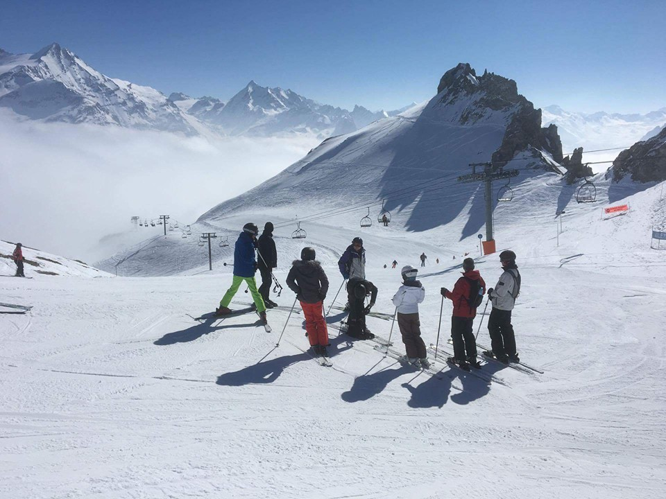

### My name is Sean Johnson and I am currently studying the GIS MSc course at the University of Leeds (2019/2020).
### I have a keen interest in travelling and visited many spectacular places over the years. My favourite destination would have to be the Grand Canyon, Arizona, USA. 
### I also have a love for skiing. For example, I visit the French Alps every year to ski with my friends. Take a look at this photo of us from last year.

