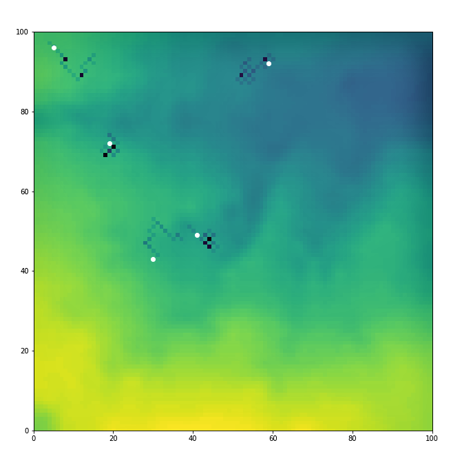

## GEOG5990M - Programming for GIS: Core Skills 
### Assessment 1 - Agent-Based Model
This part of the online portfolio contains the [final agent-based model](https://github.com/Seanj15/GEOG5990M-Assessment-1) produced for the ['*GEOG5990M - Programming for GIS: Core Skills*'](https://www.geog.leeds.ac.uk/courses/computing/) course at the University of Leeds. The model has been coded in python, using an open source cross-platform IDE called '*Spyder*' (downloaded as part of the [Anaconda Distribution](https://www.anaconda.com/distribution/)). 
### About the model
The aim of the project was to build up a simple [agent based model](https://en.wikipedia.org/wiki/Agent-based_model) (ABM) to simulate sheep (agents) grazing in an environment. At a basic level the ABM:
- builds an agent in space;
- gets them to interact with each other;
- reads in environmental data;
- gets agents to interact with the environment;
- randomizes the order of agent actions;
- displays the model as an animation;
- is contained within a Graphical User Interface (GUI);
- is initialised with data from the web.

As you can see from picture below (Figure 1), this produced a very basic model. 

Figure 1: A simple ABM - produced from the practical sessions in GEOG5990M - Programming for GIS: Core Skills.

### Enhancements to the model
In order to enhance the ABM, the following developments have been made:
- The agents now wander around the full environment (300 x 300 grid);
- There is now a boundary condition to stop the agents wandering off the edge of the environment.
- The agents will share food with other sheep nearby.
- The agents will sick up their food store in a location if they have eaten more than 100 units.
- The model introduces a second class, whereby predators will move randomly around the environment.
- The predators will remove (eat) sheep from the environment, if sheep are within a certain distance of the predator.
- It is now possible to adjust the number of sheep and the number of predators, using the scale bars in the GUI.

### Running the model
To run the model:
- Open up Spyder (Anaconda).
- Make sure your Graphics backend is set to "*Tkinter*". If not, select "*Tools*", then "*Preferences*". Scroll down on the menu bar (left-hand side) and select "*IPython console*". Select "*Graphics*" from the top, and then select "*Tkinter*" from the Backend drop down.
- You may then have to restart Spyder.
- Once you've done this , click on "*Run File*" (large green arrow).
- Two windows will appear. One entitled "*Figure 1*" (ignore this) and another entitled "*Model*" (the GUI).
- Open up the "*Model*" window and choose the number of sheep and predators you want in the ABM.
- Then select "*Start the ABM*" to run the model.
- If you want to stop the model, select "*Quit*" and close both windows.

### Link to the model
The model can be found in this [repository](https://github.com/Seanj15/GEOG5990M-Assessment-1).
Here you will find three files:
- **model.8.py** = a file than contains the core of the code.
- **agentframework6.py** = a file that initialises the agents in a random location, and moves them.
- **in.txt** = a file containing raster data which is used as the agents environment.

